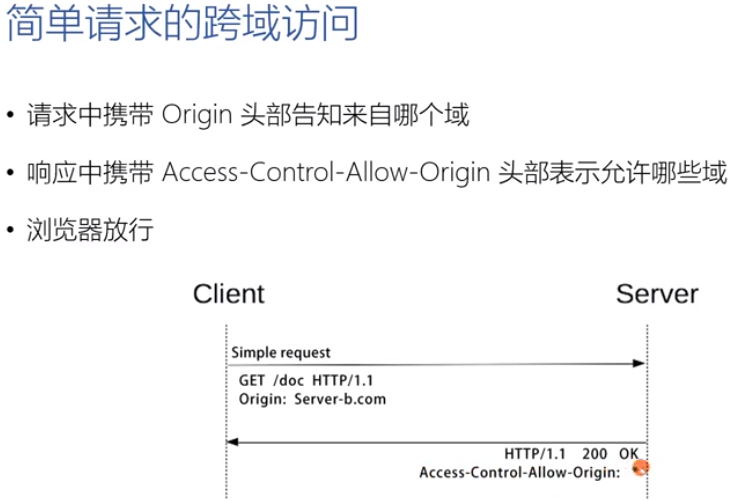
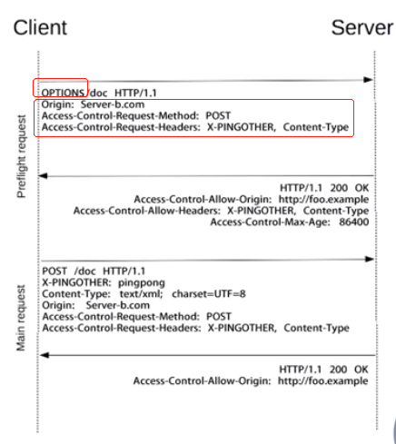

### 为什么需要同源策略（协议、主机、端口必须完全相同）
不能保证请求是用户自愿发出的？
* 安全性与可用性需要一个平衡点
    * 可用性：HTML的创作者 决定跨域请求是否对本站点安全；
        * `<script><iframe><link><video><audio>`带有src属性可以跨域访问；
        * 允许跨域 写操作：例如：表单提交或者重定向请求；
            * CSRF安全性问题
    * 安全性：浏览器需要防止站点A的脚本向站点B发起危险动作；
        * Cookie、LocalStorage和indexDB无法读取
        * DOM无法获取
        * Ajax请求不能发送

### 如何合法跨域请求 （CORS）
* 浏览器同源策略下的跨域访问解决方案
    * 如果站点A允许站点B的脚本访问其资源，必须`在HTTP响应中显式的告知浏览器`：站点B是被允许访问的。
        * 访问站点A的请求，浏览器应告知该请求来自站点B；
        * 站点A的响应中，应明确那些跨域请求是被允许的；

* 策略1：何为简单请求?
    * GET/POST/HEAD方法之一;
    * 仅能使用`CORS安全的头部`：`Accept/Accept-Language;Context-Language/Content-Type`;
    * Content-Type值只能是：`text/plain 、multipart/form-data、application/x-www-form-urlencoded`三者之一;
* 策略2：简单请求以外的其他请求
    * 访问资源前，需要先发起prefilght预检请求（方法为OPTIONS）询问何种请求是被允许的；

* 简单请求
    ```s
        request头
            origin:
        响应头：
            Access-Control-Allow-Origin：''
    ```


* 预检请求
    * 预检请求头部
        * Access-Control-Request-Method
        * Access-Control-Request-Headers
    * 预检请求响应
        * Access-Control-Allow-Methods
        * Access-Control-Allow-Headers
        * Access-Control-Max-Age



* 跨域资源请求响应头部：
    * 请求头
        * Origin
        * Access-Control-Request-Method
        * Access-Control-Request-Headers
    * 响应头 (6个)
        * Access-Control-Allow-Methods
        * Access-Control-Allow-Headers
        * Access-Control-Max-Age
        * Access-Control-Expose-Headers
            * 告知浏览器那些响应头部可以供客户端使用，默认情况下只有Cache-Control、Content-language、Content-Type、Expires、Last-Modified、Pargma可使用
        * Access-Control-Allow-Origin
            * `为了避免缓存错乱`，响应中需要携带Vary:Origin
        * Access-Control-Allow-Credentials
            * 告知浏览器是否可以使用Credentials暴露给客户端使用。Credentials包含（cookie、authorization类头部、TLS证书）
