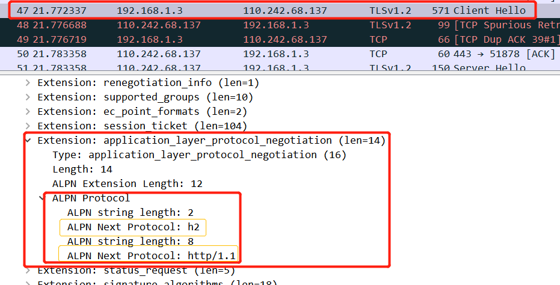

### http2
##### http1.1出现的问题：
1. 高延长带来页面加载速度的降低
    * 随着带宽的增加，延迟并没有明显下降（最后一公里）；
    * 并发连接有限；
    * 同一连接 同时只能在完成一个http事务才能处理下一个事务；
2. 高延迟 vs 高带宽 
    * 单连接上的串行请求；
    * 无状态导致的高传输量；
3. 无状态特性带来的巨大HTTP头部（cookie）
4. http1.1为了解决性能问题：
    * 合并多张小图
    * inlinling内联,将图片嵌入到css和html文件中，减少网络请求次数
    * 拼接 --多个体积较小的js合并1个体积较大的js文件；
    * 分片，将同一个页面的资源 分散到不同域名下，提升连接上限；

##### Huffman
* Huffman编码：
    * 原理:“出现概率较大的符合采用较短的编码，概率较小采用较长的编码;
    * 静态Huffman编码
    * 动态Huffman编码
* Huffman树的构造过程
    * 计算各字母出现的概率
    * 将出现频率最小的两个字母相加构成子树，左小又大；
    * 重复步骤2，直到完成树的构造；
    * 给树的左边链接编码为0，右链接编码为1；
    * 每个字母的编码从根结点到所在叶子结点中所有链接的编码；

##### http2
1. (http无状态，每次请求传输大量的重复数据)解决http1.1头部臃肿问题；
2. http1.X队头阻塞；

###### HTTP2特性:
1. SPDY（2012-2016）
2. http2 （RFC7540 2015.5）
    * 使用 http/1.X的客户端和服务器可以无缝的通过代理方式转接到http2上
    * 不识别http/2的代理服务器可以将请求降低到http/1.x;
    * 老的scheme不变，没有http2://
    * 请求应答模式没有变化,语义没有发生变化(比如请求方法、URI、状态码、头字段等概念都保留不变)
    * 二进制格式 --把原来的`“Header+Body”`的消息“打散”为数个小片的`二进制“帧”（Frame）`，用`“HEADERS”帧`存放`头数据`、`“DATA”帧`存放`实体数据`。
    * 多路复用带来提升；
3. 快速推广的原因
    * 未改变http1.1的语义；
    * 基于TCP，仅在应用层变动;

4. http/2主要特性
    * 传输数据量的大幅度减少
        * 以二进制的方式传输
        * 标头压缩
    * 多路复用（消息优先级）
    * 服务端消息推送（并行推送）
5. 对称加密的密钥 --随着连接生成，实时变化

##### HTTP1 升级 HTTP2
1. http/2是不是必须基于TLS/SSL协议
    * IETF标准不要求必须基于TLS/SSL协议;
    * 浏览器要求必须基于TLS/SSL协议;
    * 在TLS层 `ALPN(Application Layer Protocol Negotiation)扩展`做协商，只认HTTP/1.X的代理服务器不会干扰HTTP/2; (Negotiation 协商)
    * shema:http://和https:// 默认基于80/443端口;
    * h2:基于TLS协议运行的HTTP/2被称为h2;
    * h2c:基于TCP协议之上运行的HTTP/2被称为h2c;
2. h2c握手 --类似于websocket
* 在http1.1基础上（get请求）协议升级；
    * 请求:
    ```
    GET /HTTP/1.1 \r\n
    connection:upgrade,HTTP2-Settings\r\n
    Upgrade:h2c\r\n
    HTTP-Settings:AAMAABKAAQQQP__\r\n
    \r\n
    ```

    * 响应：
    ```
    HTTP/1.1  101 Switching Protocols \r\n
    connection:upgrade\r\n
    Upgrade:h2c\r\n
    \r\n
    ```
* 客户端发送的Magic帧
    * preface（前序） (ASCII编码 12字节)
        * 何时发送?
            * 接收到服务器发送的101 Switching Protocols
            * TLS握手成功后
        * Preface内容(16进制 转换的内容就是 PRI* HTTP/2.0)
            * 505249202a200d0a0a0a534d0d0a0d0a
            * PRI * HTTP/2.0 \r\n\r\nSM\r\n\r\n
        * 发送完毕后，应紧跟 SETTINGS帧

    * 客户端
    ```
    Stream:Magic
        Magic: PRI * HTTP/2.0\r\n\r\nSM\r\n\r\n
    ```
* 客户端：SETTINGS Frame
* 服务器：SETTINGS Frame
* 服务器：SETTINGS Frame with ACK flag
* 客户端：SETTINGS Frame with ACK flag

3. h2 -- 在TLS上从HTTP/1升级到HTTP/2
    1. 在 Client hello 和 Server hello中通过(`ALPN extension`)扩展协议，建立h2协议;（协商过程）
    2. Client发送Magic帧;

    
    

##### streamID
* 作用 
    * 实现多路复用的关键
    * 同一 Stream 内的 frame必须是有序的(无法并发)
    * SETTINGS_MAX_CONCURRENT_STREAMS控制并发 Stream数
    * 推送依赖性 请求的关键
        * 由客户端建立的流 必须是奇数;
        * 由服务器建立的流 必须是偶数;
    * 流 状态管理 的约束性规定
        * 新建立的流ID必须大于曾经建立过的状态为opened或者resered的流ID；
        * 在新建立的流上发送帧时，意味着将更小ID且为idle状态的流置为closed状态；
        * stream ID 不能复用(最大2^31)，长连接耗尽ID 应创建新连接；
    * 应用层流控 仅影响数据帧
        * stream ID为0的流 仅用于传输控制帧；
    * 在http/1 升级到 h2c中，以ID为1流返回响应，之后流进入half-closed（local）状态；

##### http2帧

1. 帧格式

    1. 帧长度 (Length)
        1. 所有实现必须可以支持 16KB以下的帧
        2. 传递16KB到16MB的帧时，必须接收端首先公布自己可以处理此大小
            * 通过SETTINGS_MAX_FRAME_SIZE 帧(Identifier=5)
        告知；

    2. 帧类型 Type
    3. Flags
    4. 

##### HPACK头部压缩
* PRC7541
* 三种压缩方式
    * 静态字典 (Static Table)
    * 动态字典 (Dynamic Table)
    * 压缩算法： Huffman编码(最高压缩比 8:5)
* 静态字典
    * 带value
    * 不带value


* 解决办法：使用HPACK 头部压缩
1. 压缩方式
    1. 静态字典
    2. 动态字典
    1. 压缩算法：Huffman编码(最高压缩比8:5)
* 索引表格式：
    * index Hardname Hardvalue
    * 有些含hardvalue，有些不含hardvalue
* h2load 工具测试
* 访问一次：静态表和Huffman编码
* 访问一次以上：静态表/动态表/Huffman,访问次数越多，压缩比越大；
* 为什么可以反复传输，依靠动态表提高压缩比；

* http的head如何编码 --Huffman编码


* HTTP/2 还添加了一些`控制帧`来`管理` `虚拟的“流”`，实现了`优先级和流量控制`
2. HTTP/2 的消息不再是“Header+Body”的形式，而是分散为多个二进制“帧”；HTTP/2 使用虚拟的“流”传输消息，解决了困扰多年的“队头阻塞”问题，同时实现了“多路复用”，提高连接的利用率；