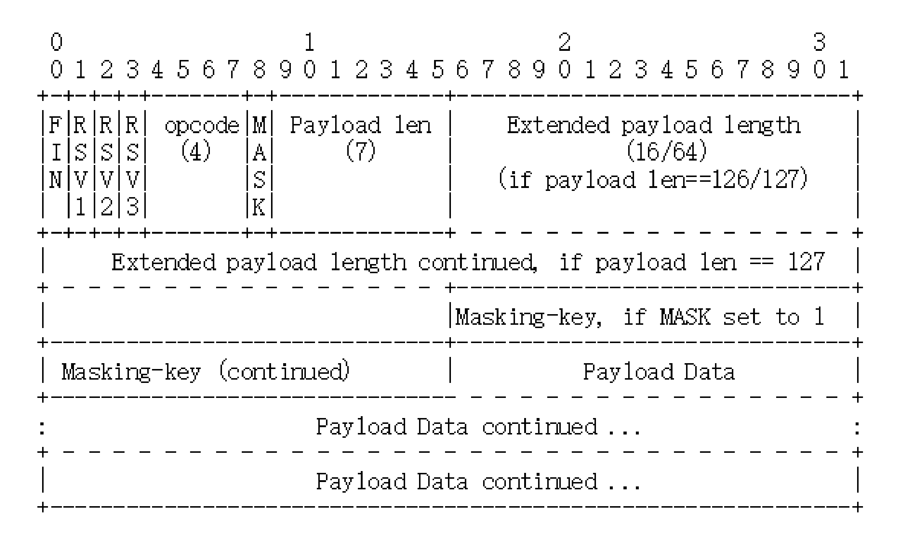

## websocket
“WebSocket”是一种基于 TCP 的轻量级网络通信协议.


##### 特点
1. 全双工;
2. 采用二进制帧结构,语法、语义与 HTTP 完全不兼容;
3. 引入新协议名：ws/wss;
4. 端口:80/443 , 因为现在互联网上的防火墙屏蔽了绝大多数的端口，只对 HTTP 的 80、443 端口“放行”,所以 WebSocket 就可以“伪装”成 HTTP 协议，比较容易地“穿透”防火墙，与服务器建立连接;
5. 侧重"实时通信";
6. 帧结构长度长度 2~14字节；

##### websocket握手 (HTTP 报文)(WebSocket 的升级请求)

* 利用了 HTTP 本身的“协议升级”特性，“伪装”成 HTTP，这样就能绕过浏览器沙盒、网络防火墙等等限制;
* WebSocket 的握手是一个标准的 HTTP GET 请求,但要带上两个协议升级的专用头字段：
    * “Connection: Upgrade”，表示要求协议“升级”;
    * “Upgrade: websocket”，表示要“升级”成 WebSocket 协议。
* 为了防止普通的http协议被“意外”识别陈websocket，握手时还需增加两个<code>认证的头字段</code>
    * Sec-WebSocket-Key：<code>一个Base64 编码的 16 字节随机数</code>，作为简单的<code>认证密钥</code>;
    * Sec-WebSocket-Version：协议的版本号，当前必须是 13。
* Status Code: 101 Switching Protocols;
* 服务端特殊字段：“Sec-WebSocket-Accept”<code>验证客户端的请求报文</code>，同样也是为了<code>防止误连接</code>。
    * 通过请求头里“Sec-WebSocket-Key”的值，加上一个专用的 UUID “258EAFA5-E914-47DA-95CA-C5AB0DC85B11”，再计算 SHA-1 摘要。
* 客户端收到响应报文，就可以用同样的算法，比对（Sec-WebSocket-Accept）值是否相等，如果相等，就说明返回的报文确实是刚才握手时连接的服务器，认证成功。

1. 浏览器
    * Connection: Upgrade<code>*</code>--- 表示需要转换为其他协议;
    * Upgrade: websocket<code>*</code> --- 转换成websocket协议;
    * Sec-websocket-key：y4bk8yup6Xb6fRpCtLoeUw==;<code>*</code> --- 认证密钥
    * Sec-WebSocket-Version: 13 -- 告知服务端的websocket协议版本
    * Sec-websocket-extensions: 扩展协议 -- 比如：<code>Sec-websocket-extensions:permessage-deflate; client_max_window_bits</code> 代表客户端支持的扩展类型；开启压缩功能;
    * Sec-websocket-protocol: chat, superchat -- 子协议
    
2. server
    * Connection: Upgrade<code>*</code>--- 表示需要转换为其他协议;
    * Upgrade: websocket<code>*</code> --- 转换成websocket协议;
    * Sec-websocket-extensions:permessage-deflate; （服务器支持才返回）；
    * Sec-Websocket-accept:OcmZdNYqSPWiOjnu/5nq/1TuFcw=; -- (验证客户端的 请求报文，防止误连接)；


##### 收发数据 -- 二进制帧
    
1. webSocket 的帧结构
    * 数据传输使用的是`一系列数据帧`，出于安全考虑和避免网络截获，`客户端发送的数据帧`必须进行`掩码处理`后才能发送到服务器，不论是否是在TLS安全协议上都要进行掩码处理。
    * 服务器如果没有收到掩码处理的数据帧时应该关闭连接，发送一个1002的状态码。
    * 服务器`不能`将发送到客户端的数据进行`掩码`处理，如果客户端收到掩码处理的数据帧必须`关闭连接`。
2. 控制帧
    * 控制帧用于WebSocket协议`交换状态信息`，控制帧可以插在消息片段之间。
    * 所有的控制帧的负载长度均不大于125字节，并且禁止对控制帧进行分片处理。
    * 目前`控制帧的操作码`定义了oxo8(关闭帧)、oxo9(Ping帧)、oxoA(Pong帧)。 

3. 根据ABNF的定义（加密）

    

* 第一个字节(8位)
    * 第一位“FIN”是消息结束的标志位,表示数据发送完毕。一个消息可以拆成多个帧，接收方看到“FIN”后，就可以把前面的帧拼起来，组成完整的消息。
    * 2-4位（RSV1,RSV2,RSV3）：保留位，扩展进行定义，一般情况下全为0。
    * 后4位，`OPcode操作码`，其实就是`帧类型`（决定了如何解析后续的数据载荷 [data palyload]）. 比如 1 表示`帧内容`是纯文本，2 表示`帧内容`是二进制数据，8 是关闭连接，9 和 10 分别是`连接保活的 PING 和 PONG`。
        * %x0:延续帧。当OPcode为0时，表述本次数据传输采用数据分片；
        * %x1:帧内容为文本帧;
        * %x2:帧内容为二进制帧;
        * %x3-7:保留的操作代码（非控制帧）;
        * %x8:连接断开；
        * %x9:ping操作;
        * %x10:pong操作;

* 第2字节
    * 第一位是`掩码`标志位“MASK”;表示`帧内容`是否使用`异或操作`（xor）做简单的加密。客户端发送数据必须使用掩码，而服务器发送则必须不使用掩码。
    * 后 7 位是“Payload len”,表示帧内容的长度。是一种`变长编码`，最少 7 位，最多是 7+64 位，也就是额外增加 8 个字节，所以一个 `WebSocket 帧最大是 2^64`。
* Masking-key
    * “Masking-key”，掩码密钥，它是由上面的标志位“MASK”决定的，如果使用 `掩码就是4 个字节的随机数`，否则就不存在。
    * 掩码的安全强度几乎是零，用“Masking-key”简单地异或一下就可以转换出明文.

4. [例子](https://www.cnblogs.com/jocongmin/p/9236485.html)：心跳检测 -- 发送 ping 帧 

##### 心跳检测
* 连接可能因为许多无法控制的原因而意外关闭。
* 有些连接关闭的原因可以避免，可以避免的常见连接丢失原因是`TCP级别的空闲`，这会影响WebSocket连接.
* 因为WebSocket连接处于TCP连接的上层，发生在TCP级别的连接问题会影响WebSocket连接。
* 用WebSocket ping和pong能够保持连接打开。
* ping和pong可以从打开的WebSocket连接的任一端发起。

* ping帧：
    * ping帧可以包含应用数据。
    * 一旦接收到ping帧，断点 必须返回pong帧作为响应，除非收到一个关闭帧；

* pong帧
    * Pong帧必须与Ping帧拥有<code>相同的应用数据部分</code>。
    * 如果端点收到了多个Ping帧，但还没来的及全部回应，可以只回应最后一个Ping帧。
    * Pong帧可以在未收到Ping帧时就被发送，用作<code>单向心跳包</code>。
    * 不需要对未被请求的Pong帧（对方主动发送的Pong帧）进行回应。


##### websocket关闭会话的方式
1. 控制帧中的关闭帧：在TCP连接之上的双向关闭
    * 发送关闭帧后，不能在发送任何数据；
    * 接收到关闭帧后，不能再接收任何到达的数据
    * 先发送关闭帧（websocket关闭），然后再TCP四次挥手，断开TCP连接；
2. TCP连接意外中断
3. 关闭帧格式
    * opcode=8;
    * 可以含有数据(palyload)，但仅用于解释关闭会话的原因 (如：1000:正常关闭 ；1002：发现协议错误)
        * 前2字节为无符合整型
        * 遵循mask掩码规则


##### 其他知识 -- 语法格式描述规范BNF、EBNF、ABNF

##### Socket.io
* 基于 Node 的 JavaScript 框架;
* 包含 client 的 JavaScript 和 server 的 Node;
* Socket.io不是Websocket;
* 将`Websocket`和`轮询 （Polling）机制`以及`其它的实时通信方式`封装成了`通用的接口`，并且`在服务端实现了这些实时机制的相应代码`。

##### websocket相关面试题目
1. 什么是websocket？
websocket是HTML5的一个新协议，它允许服务端向客户端传递信息，实现浏览器和客户端双工通信;
通过 send() 方法来向服务器发送数据，并通过 onmessage事件来接收服务器返回的数据;
`var Socket = new WebSocket(url, [protocol] );`

2. 全双工通讯协议的概念
通信允许数据在两个方向上`同时传输`;
3. WebSocket和Socket的区别是什么？
Socket是`应用层与TCP/IP协议`通信的中间软件抽象层，它是`一组接口`。而WebSocket则不同，它是`一个完整的应用层协议`，包含`一套标准的API`。
4. WebSocket的服务器推送和http2.0服务器推送区别
    * http2.0服务器推送主要应用场景：
        1. 推送css/js等资源
        ```js
        spdy.createServer(options, function(req, res) {
        // push JavaScript asset (/main.js) to the client
        res.push('/main.js', {'content-type': 'application/javascript'}, function(err, stream) {
            stream.end('alert("hello from push stream!")');
        });

        // write main response body and terminate stream
        res.end('Hello World! <script src="/main.js"></script>');
        }).listen(443);
        ```
        2. 推送一次重定向(资源替换) -- 服务器能够主动的管理客户端缓存
        ```js
        spdy.createServer(options, function(req, res) {
        //push JavaScript asset (/newasset.js) to the client
        res.push('/newasset.js', {'content-type': 'application/javascript'}, function(err, stream) {
            stream.end('alert("hello from (redirected) push stream!")');
        });

        // push 301 redirect: /asset.js -> /newasset.js
        res.push('/asset.js', {':status': 301, 'Location': '/newasset.js'}, function(err, stream) {
            stream.end('301 Redirect');
        });

        // write main response body and terminate stream
        res.end('<script src="/asset.js"></script>');
        }).listen(443);
        ```
    * WebSocket主要用来推送数据，http2.0推送资源(管理客户端缓存)；

5. http和websocket的长连接心跳保持区别
    * http长连接只能基于简单的超时(常见65秒);
    * WebSocket连接基于ping/Pong心跳机制维持
